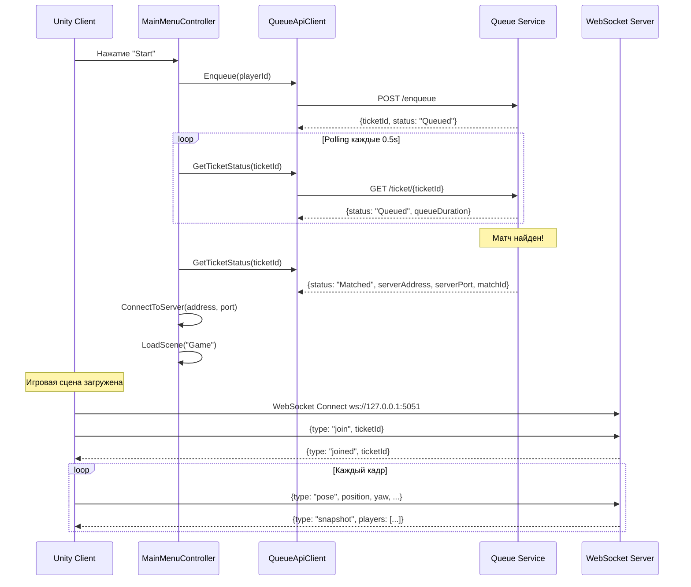
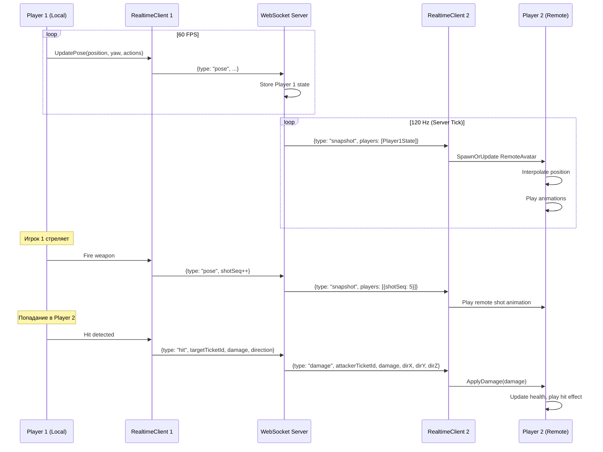
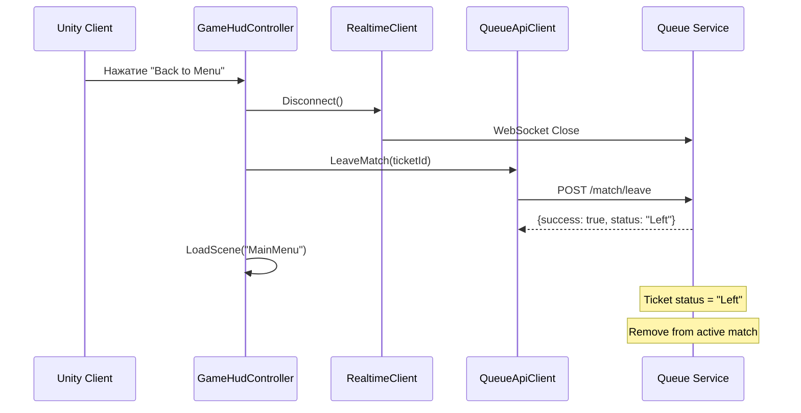
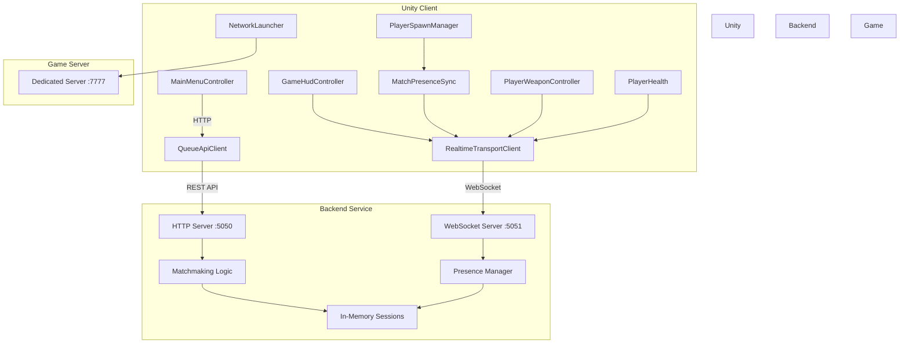

# Анализ архитектуры проекта ShooterPrototype

## Обзор проекта

**ShooterPrototype** - это многопользовательский шутер на Unity с клиент-серверной архитектурой, использующий кастомную систему матчмейкинга и синхронизации в реальном времени.

---

## Архитектурные компоненты

### 1. Unity Client (Frontend)

#### 1.1 Структура проекта
```
Assets/
├── Scripts/
│   ├── Bootstrap/        # Инициализация игры
│   ├── Matchmaking/      # Клиент очереди матчмейкинга
│   ├── Network/          # Сетевые компоненты
│   ├── Player/           # Логика игрока
│   ├── UI/              # Пользовательский интерфейс
│   └── Editor/          # Инструменты редактора
├── Scenes/
│   ├── MainMenu.unity   # Главное меню
│   └── Game.unity       # Игровая сцена
├── Network/
│   └── NetworkConfig.asset  # Конфигурация сети
└── Prefabs/             # Префабы игровых объектов
```

#### 1.2 Ключевые компоненты Unity

**Matchmaking Layer:**
- [`QueueApiClient.cs`](Assets/Scripts/Matchmaking/QueueApiClient.cs) - HTTP клиент для взаимодействия с Queue Service
  - Методы: `Enqueue()`, `Dequeue()`, `GetTicketStatus()`, `LeaveMatch()`
  - Использует `UnityWebRequest` для HTTP запросов
  - Базовый URL: `http://127.0.0.1:5050` (настраивается)

- [`QueueServiceMock.cs`](Assets/Scripts/Matchmaking/QueueServiceMock.cs) - Локальная имитация матчмейкинга
  - Используется для тестирования без бэкенда
  - Поддерживает очередь, таймауты, создание матчей

**Network Layer:**
- [`NetworkLauncher.cs`](Assets/Scripts/Network/NetworkLauncher.cs) - Центральный менеджер сетевых подключений
  - Управляет подключением к серверу
  - Хранит контекст матча (matchId, ticketId, playerCount)
  - Измеряет пинг и латентность

- [`RealtimeTransportClient.cs`](Assets/Scripts/Network/RealtimeTransportClient.cs) - WebSocket клиент для real-time синхронизации
  - Подключается к `ws://127.0.0.1:5051`
  - Отправляет позиции игрока, действия (выстрелы, перезарядка)
  - Получает снапшоты состояния других игроков
  - Обрабатывает сообщения о повреждениях

- [`NetworkConfig.asset`](Assets/Network/NetworkConfig.asset) - Конфигурация сети
  ```yaml
  serverAddress: 127.0.0.1
  serverPort: 7777
  connectTimeoutSeconds: 5
  autoStartMockServerInBatchMode: true
  ```

**Player Systems:**
- [`PlayerSpawnManager.cs`](Assets/Scripts/Player/PlayerSpawnManager.cs) - Спавн локального и удаленных игроков
- [`MatchPresenceSync.cs`](Assets/Scripts/Player/MatchPresenceSync.cs) - Синхронизация позиций и состояний
- [`PlayerWeaponController.cs`](Assets/Scripts/Player/PlayerWeaponController.cs) - Управление оружием, стрельба
- [`PlayerHealth.cs`](Assets/Scripts/Player/PlayerHealth.cs) - Система здоровья и урона
- [`LocalPlayerMarker.cs`](Assets/Scripts/Player/LocalPlayerMarker.cs) - Маркер локального игрока

**UI Layer:**
- [`MainMenuController.cs`](Assets/Scripts/UI/MainMenuController.cs) - Главное меню
  - Поиск матча через Queue Service
  - Polling статуса тикета
  - Подключение к серверу при нахождении матча
  - Автоматическая загрузка игровой сцены

- [`GameHudController.cs`](Assets/Scripts/UI/GameHudController.cs) - Игровой HUD
  - Отображение статуса подключения, пинга, FPS
  - Счетчики патронов и здоровья
  - Кнопка возврата в меню
  - Автоматическое отключение при потере связи

**Bootstrap:**
- [`GameBootstrap.cs`](Assets/Scripts/Bootstrap/GameBootstrap.cs) - Инициализация игры
  - Создает runtime компоненты (QueueApiClient, RealtimeTransportClient)
  - Настраивает DontDestroyOnLoad объекты
  - Инициализирует HUD

#### 1.3 Unity Packages
```json
{
  "com.unity.inputsystem": "1.18.0",
  "com.unity.render-pipelines.universal": "17.3.0",
  "com.unity.multiplayer.center": "1.0.1",
  "com.unity.ai.navigation": "2.0.10"
}
```

---

### 2. Backend Service (Node.js)

#### 2.1 Queue Service
**Расположение:** [`Backend/QueueService/server.js`](Backend/QueueService/server.js)

**Технологии:**
- Node.js HTTP server (порт 5050)
- WebSocket server через `ws` библиотеку (порт 5051)
- Без внешних баз данных (in-memory хранилище)

**Основные функции:**

**HTTP API (REST):**
- `POST /enqueue` - Добавить игрока в очередь
- `POST /dequeue` - Удалить игрока из очереди
- `GET /ticket/{ticketId}` - Получить статус тикета
- `POST /match/leave` - Покинуть матч
- `POST /match/presence/update` - Обновить позицию игрока (HTTP fallback)
- `POST /match/presence/sync` - Синхронизировать и получить состояния
- `GET /match/presence/{ticketId}` - Получить снапшот матча
- `GET /health` - Проверка здоровья сервиса
- `GET /telemetry/active` - Телеметрия активных сессий

**WebSocket API (Real-time):**
- `join` - Присоединиться к матчу по ticketId
- `pose` - Отправить состояние игрока (позиция, анимация, действия)
- `hit` - Нанести урон другому игроку
- `snapshot` - Получать периодические снапшоты других игроков
- `damage` - Получить уведомление о полученном уроне
- `joined` - Подтверждение подключения

**Логика матчмейкинга:**
```javascript
MIN_PLAYERS_TO_MATCH = 2
TARGET_PLAYERS_PER_MATCH = 2
MATCH_TIMEOUT_SECONDS = 20
MATCH_BATCH_WINDOW_SECONDS = 2
SERVER_TICK_RATE = 120 Hz
```

**Состояния тикета:**
- `Queued` - В очереди
- `Matched` - Матч найден
- `Cancelled` - Отменен игроком
- `Expired` - Истек таймаут
- `Disconnected` - Отключен от матча
- `Left` - Покинул матч

**Алгоритм матчмейкинга:**
1. Игроки добавляются в очередь с уникальным ticketId
2. Каждый тик сервер проверяет условия создания матча:
   - Достаточно игроков (≥ MIN_PLAYERS_TO_MATCH)
   - Прошло время ожидания (MATCH_BATCH_WINDOW_SECONDS)
3. При создании матча:
   - Создается session с уникальным matchId
   - Игрокам присваивается статус "Matched"
   - Возвращается адрес сервера (127.0.0.1:7777)
4. Игроки подключаются через WebSocket для real-time синхронизации

**Система присутствия (Presence):**
- Каждый игрок отправляет свое состояние через WebSocket
- Сервер рассылает снапшоты других игроков каждому клиенту
- Фильтрация: клиент не получает свое собственное состояние
- Таймаут присутствия: 5 секунд (PRESENCE_TIMEOUT_SECONDS)
- Grace period для подключения: 45 секунд

**Данные состояния игрока:**
```javascript
{
  position: {x, y, z},
  yaw, lookPitch,
  shotSeq, reloadSeq, hitPlayerSeq, footstepSeq,
  isCrouching, wallAvoidBlend,
  isDead, deathSeq, deathFallDir,
  animSpeed, isAiming, isGrounded, jumpState, animPhase
}
```

---

## Поток данных и взаимодействие

### Сценарий 1: Поиск матча и подключение



### Сценарий 2: Игровой процесс (Real-time синхронизация)



### Сценарий 3: Выход из матча



---

## Ключевые архитектурные решения

### 1. Гибридная синхронизация
- **HTTP REST API** для матчмейкинга и управления сессиями
- **WebSocket** для real-time синхронизации игрового состояния
- Преимущества: надежность HTTP + низкая латентность WebSocket

### 2. Stateful Backend
- Все данные хранятся в памяти (Map, Set)
- Нет персистентности - при перезапуске все сессии теряются
- Подходит для MVP и локального тестирования
- Для продакшена потребуется Redis/PostgreSQL

### 3. Client-Side Prediction
- Локальный игрок управляется напрямую (без задержки)
- Удаленные игроки интерполируются на основе снапшотов
- Сервер - источник истины для урона и хитов

### 4. Tick-based Server
- Сервер работает на фиксированной частоте (120 Hz)
- Периодическая рассылка снапшотов всем клиентам
- Maintenance sweep для очистки устаревших данных

### 5. Graceful Degradation
- Автоматическое переподключение WebSocket
- Fallback на HTTP для обновления позиций
- Таймауты и grace periods для нестабильных соединений

---

## Точки расширения и улучшения

### 1. Масштабируемость
**Текущие ограничения:**
- Один процесс Node.js (single-threaded)
- In-memory хранилище
- Один игровой сервер (127.0.0.1:7777)

**Рекомендации:**
- Добавить Redis для shared state между инстансами
- Реализовать load balancer для распределения нагрузки
- Динамическое создание dedicated серверов
- Kubernetes для оркестрации

### 2. Безопасность
**Текущие уязвимости:**
- Нет аутентификации игроков
- Нет валидации на стороне сервера (trust client)
- CORS открыт для всех (`*`)
- Нет rate limiting

**Рекомендации:**
- JWT токены для аутентификации
- Server-side валидация всех действий
- Anti-cheat система
- Rate limiting и DDoS защита

### 3. Персистентность
**Отсутствует:**
- История матчей
- Статистика игроков
- Прогресс и достижения

**Рекомендации:**
- PostgreSQL для реляционных данных
- MongoDB для логов и телеметрии
- S3 для replay файлов

### 4. Мониторинг
**Текущее состояние:**
- Базовая телеметрия через `/telemetry/active`
- Console.log для отладки

**Рекомендации:**
- Prometheus + Grafana для метрик
- ELK Stack для логов
- Sentry для error tracking
- Custom dashboards для game analytics

---

## Диаграмма компонентов



---

## Конфигурация и переменные окружения

### Unity Client
```csharp
// NetworkConfig.asset
serverAddress: "127.0.0.1"
serverPort: 7777
connectTimeoutSeconds: 5

// QueueApiClient
baseUrl: "http://127.0.0.1:5050"
requestTimeoutSeconds: 5

// RealtimeTransportClient
websocketUrl: "ws://127.0.0.1:5051"
```

### Backend Service
```bash
PORT=5050
REALTIME_WS_PORT=5051
MATCH_SERVER_ADDRESS=127.0.0.1
MATCH_SERVER_PORT=7777
MIN_PLAYERS_TO_MATCH=2
TARGET_PLAYERS_PER_MATCH=2
MATCH_TIMEOUT_SECONDS=20
MATCH_BATCH_WINDOW_SECONDS=2
PRESENCE_TIMEOUT_SECONDS=5
MATCH_CONNECT_GRACE_SECONDS=45
SERVER_TICK_RATE=120
DEBUG_REALTIME=1
```

---

## Заключение

Проект **ShooterPrototype** представляет собой хорошо структурированный MVP многопользовательского шутера с четким разделением ответственности между компонентами. Архитектура позволяет быстро итерировать и тестировать игровую механику, но требует доработки для продакшен-окружения.

**Сильные стороны:**
- ✅ Модульная архитектура
- ✅ Разделение HTTP и WebSocket протоколов
- ✅ Гибкая система матчмейкинга
- ✅ Real-time синхронизация с низкой латентностью
- ✅ Graceful degradation и reconnect логика

**Области для улучшения:**
- ⚠️ Безопасность и валидация
- ⚠️ Масштабируемость и персистентность
- ⚠️ Мониторинг и observability
- ⚠️ Dedicated server management
- ⚠️ Anti-cheat система

Архитектура готова для дальнейшего развития и добавления новых фич, таких как система бега (sprint), которая была запрошена пользователем.
