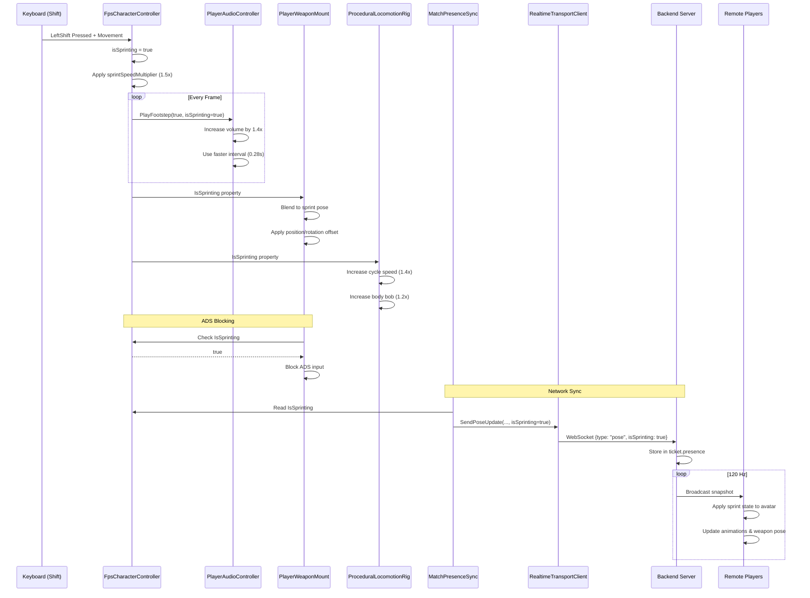

# План реализации системы бега (Sprint)

## Обзор задачи

**Цель:** Заменить текущую систему медленной ходьбы (sneak) на Shift на систему бега (sprint) с:
- Увеличенной скоростью передвижения
- Более быстрыми анимациями
- Более громкими звуками шагов
- Специальной анимацией оружия (прижато к телу)
- Блокировкой прицеливания (ADS) во время бега
- Синхронизацией состояния на сервере

---

## Текущее состояние системы

### Управление движением (FpsCharacterController.cs)

**Текущая логика Shift:**
```csharp
// Строка 20: sneakSpeedMultiplier = 0.78f (78% от базовой скорости)
// Строка 52: private bool isSneaking;
// Строка 266: isSneaking = !isCrouching && ReadSneakPressed();
// Строка 298-301: Применение sneakSpeedMultiplier
// Строка 325-326: Sneak движение бесшумное (без footsteps)
// Строка 531-538: ReadSneakPressed() читает LeftShift
```

**Параметры движения:**
- `moveSpeed = 5.5f` - базовая скорость
- `crouchSpeedMultiplier = 0.55f` - 55% при приседании
- `sneakSpeedMultiplier = 0.78f` - 78% при медленной ходьбе
- `footstepIntervalSlow = 0.8f` - медленные шаги
- `footstepIntervalFast = 0.42f` - быстрые шаги

**Звуки шагов:**
- Crouch/Sneak: полностью бесшумные (строки 324-328)
- Обычная ходьба: интерполяция между slow/fast интервалами

---

## Архитектура решения

### 1. Изменения в FpsCharacterController.cs

#### 1.1 Новые параметры
```csharp
[Header("Sprint")]
[SerializeField] private float sprintSpeedMultiplier = 1.5f;  // 150% от базовой скорости
[SerializeField] private float sprintFootstepInterval = 0.28f; // Быстрее чем обычная ходьба
[SerializeField] private float sprintFootstepVolumeMultiplier = 1.4f; // Громче на 40%
[SerializeField] private bool blockAdsWhileSprinting = true;

private bool isSprinting;
```

#### 1.2 Модификация логики движения
```csharp
// В методе TickMove():
// ЗАМЕНИТЬ строку 266:
// isSneaking = !isCrouching && ReadSneakPressed();
// НА:
isSprinting = !isCrouching && ReadSprintPressed() && moveInputMagnitude > 0.1f;

// ЗАМЕНИТЬ строки 293-301:
var speedMultiplier = 1f;
if (isCrouching)
{
    speedMultiplier = Mathf.Clamp(crouchSpeedMultiplier, 0.1f, 1f);
}
else if (isSprinting)
{
    speedMultiplier = Mathf.Clamp(sprintSpeedMultiplier, 1f, 3f);
}
```

#### 1.3 Новая логика footsteps
```csharp
// В методе TryEmitFootstep():
// ЗАМЕНИТЬ строки 324-328:
// Crouch остается бесшумным, sprint - громкий
if (isCrouching)
{
    return; // Crouch бесшумный
}

// ЗАМЕНИТЬ строки 335-338:
var cadence = isSprinting 
    ? Mathf.Max(0.08f, sprintFootstepInterval)
    : Mathf.Lerp(
        Mathf.Max(0.1f, footstepIntervalSlow),
        Mathf.Max(0.08f, footstepIntervalFast),
        Mathf.Clamp01(horizontalSpeed / Mathf.Max(0.01f, moveSpeed)));

nextFootstepAt = Time.time + cadence;
footstepSequence++;

// Передать информацию о sprint в audio controller
audioController?.PlayFootstep(true, isSprinting);
```

#### 1.4 Новый метод чтения input
```csharp
// ЗАМЕНИТЬ ReadSneakPressed() на ReadSprintPressed():
private static bool ReadSprintPressed()
{
#if ENABLE_INPUT_SYSTEM
    return Keyboard.current != null && Keyboard.current.leftShiftKey.isPressed;
#else
    return Input.GetKey(KeyCode.LeftShift);
#endif
}
```

#### 1.5 Публичные свойства
```csharp
public bool IsSprinting => isSprinting;
// УДАЛИТЬ: public bool IsSneaking => isSneaking;
```

---

### 2. Изменения в PlayerAudioController.cs

#### 2.1 Модификация PlayFootstep
```csharp
// Текущая сигнатура:
// public void PlayFootstep(bool isLocal)

// ИЗМЕНИТЬ НА:
public void PlayFootstep(bool isLocal, bool isSprinting = false)
{
    if (footstepClips == null || footstepClips.Length == 0)
    {
        return;
    }

    var clip = footstepClips[Random.Range(0, footstepClips.Length)];
    var source = isLocal ? localAudioSource : remoteAudioSource;
    
    if (source == null || clip == null)
    {
        return;
    }

    // Увеличить громкость для sprint
    var volumeMultiplier = isSprinting ? 1.4f : 1f;
    source.PlayOneShot(clip, footstepVolume * volumeMultiplier);
}
```

#### 2.2 Опциональные sprint звуки
```csharp
[Header("Sprint Audio")]
[SerializeField] private AudioClip[] sprintFootstepClips; // Опционально: отдельные звуки для бега
[SerializeField] private float sprintFootstepVolume = 0.5f;

// Если есть отдельные клипы для sprint:
if (isSprinting && sprintFootstepClips != null && sprintFootstepClips.Length > 0)
{
    clip = sprintFootstepClips[Random.Range(0, sprintFootstepClips.Length)];
    source.PlayOneShot(clip, sprintFootstepVolume);
}
```

---

### 3. Изменения в PlayerWeaponMount.cs

#### 3.1 Новые параметры для sprint pose
```csharp
[Header("Sprint")]
[SerializeField] private Vector3 sprintWeaponPositionOffset = new Vector3(0.15f, -0.1f, 0.1f);
[SerializeField] private Vector3 sprintWeaponRotationOffset = new Vector3(-15f, 10f, 5f);
[SerializeField] private float sprintPoseBlendSpeed = 8f;

private float sprintBlend;
private float sprintBlendVelocity;
private bool networkSprinting;
```

#### 3.2 Логика blend для sprint pose
```csharp
// В методе Update() или LateUpdate():
var targetSprintBlend = useNetworkState
    ? (networkSprinting ? 1f : 0f)
    : (fpsController != null && fpsController.IsSprinting ? 1f : 0f);

sprintBlend = Mathf.SmoothDamp(
    sprintBlend,
    targetSprintBlend,
    ref sprintBlendVelocity,
    1f / Mathf.Max(1f, sprintPoseBlendSpeed));

// Применить sprint offset к позиции оружия
if (sprintBlend > 0.001f)
{
    weaponPivot.localPosition += sprintWeaponPositionOffset * sprintBlend;
    weaponPivot.localRotation *= Quaternion.Euler(sprintWeaponRotationOffset * sprintBlend);
}
```

#### 3.3 Network state для sprint
```csharp
public void SetNetworkSprintState(bool isSprinting)
{
    networkSprinting = isSprinting;
}
```

---

### 4. Изменения в PlayerWeaponController.cs

#### 4.1 Блокировка ADS во время sprint
```csharp
// В методе, где обрабатывается ADS (примерно строка 200-250):
// Найти логику ReadAimPressed() и добавить проверку sprint

private void UpdateAimState()
{
    var wantsAds = ReadAimPressed();
    
    // Блокировать ADS во время sprint
    if (fpsController != null && fpsController.IsSprinting)
    {
        wantsAds = false;
    }
    
    // ... остальная логика ADS
}
```

#### 4.2 Опционально: автоматический выход из ADS при sprint
```csharp
// Если игрок начинает бежать во время ADS, принудительно выйти из ADS
if (fpsController != null && fpsController.IsSprinting && isAiming)
{
    isAiming = false;
    // Trigger exit ADS animation/blend
}
```

---

### 5. Изменения в ProceduralLocomotionRig.cs

#### 5.1 Параметры для sprint анимации
```csharp
[Header("Sprint")]
[SerializeField] private float sprintCycleSpeedMultiplier = 1.4f; // Быстрее анимация ног
[SerializeField] private float sprintBodyBobMultiplier = 1.2f; // Больше покачивание тела

private bool networkSprinting;
```

#### 5.2 Модификация анимации ходьбы
```csharp
// В методе SetNetworkAnimationState():
public void SetNetworkAnimationState(float speed01, bool grounded, int jumpState, float animPhase01, bool isCrouching = false, bool isSprinting = false)
{
    // ... существующий код
    networkSprinting = isSprinting;
}

// В методе Update() где вычисляется walkPhase (строка 258):
var cycleSpeedMultiplier = (useNetworkState && networkSprinting) || (!useNetworkState && fpsController != null && fpsController.IsSprinting)
    ? sprintCycleSpeedMultiplier
    : 1f;

walkPhase += dt * walkCycleSpeed * cycleSpeedMultiplier * Mathf.Lerp(phaseMin, 1.8f, motionSpeed01);

// Для body bob (строка 267):
var bobMultiplier = isSprinting ? sprintBodyBobMultiplier : 1f;
var bob = Mathf.Sin(walkPhase * 2f) * bodyBobHeight * motionSpeed01 * (1f - airborneBlend) * bobMultiplier;
```

---

### 6. Изменения в MatchPresenceSync.cs

#### 6.1 Добавление sprint в синхронизацию
```csharp
// В методе Update() где собирается состояние для отправки (строка 221-230):
var isCrouching = localFpsController != null && localFpsController.IsCrouching;
var isSprinting = localFpsController != null && localFpsController.IsSprinting; // НОВОЕ

// В вызове SendPoseUpdate():
realtimeClient.SendPoseUpdate(
    localTransform.position,
    localTransform.rotation.eulerAngles.y,
    lookPitch,
    shotSeq,
    reloadSeq,
    hitPlayerSeq,
    footstepSeq,
    isCrouching,
    isSprinting, // НОВЫЙ ПАРАМЕТР
    wallAvoidBlend,
    // ... остальные параметры
);
```

#### 6.2 Применение sprint состояния к remote avatars
```csharp
// В методе ApplyRemotePresence() (строка 359-377):
if (weaponMount != null)
{
    weaponMount.SetNetworkAimState(false);
    weaponMount.SetNetworkCrouchState(p.isCrouching);
    weaponMount.SetNetworkSprintState(p.isSprinting); // НОВОЕ
    weaponMount.SetNetworkWallAvoidBlend(p.wallAvoidBlend);
}

if (locomotionRig != null)
{
    locomotionRig.SetNetworkAnimationState(
        p.animSpeed,
        p.isGrounded,
        p.jumpState,
        p.animPhase,
        p.isCrouching,
        p.isSprinting); // НОВЫЙ ПАРАМЕТР
}
```

---

### 7. Изменения в RealtimeTransportClient.cs

#### 7.1 Добавление isSprinting в RealtimePlayerState
```csharp
[Serializable]
public sealed class RealtimePlayerState
{
    public string ticketId;
    public Vector3 position;
    public float yaw;
    public float lookPitch;
    public int shotSeq;
    public int reloadSeq;
    public int hitPlayerSeq;
    public int footstepSeq;
    public bool isCrouching;
    public bool isSprinting; // НОВОЕ ПОЛЕ
    public float wallAvoidBlend;
    // ... остальные поля
}
```

#### 7.2 Модификация SendPoseUpdate
```csharp
public void SendPoseUpdate(
    Vector3 position,
    float yaw,
    float lookPitch,
    int shotSeq,
    int reloadSeq,
    int hitPlayerSeq,
    int footstepSeq,
    bool isCrouching,
    bool isSprinting, // НОВЫЙ ПАРАМЕТР
    float wallAvoidBlend,
    bool isDead,
    int deathSeq,
    Vector3 deathFallDir,
    float animSpeed,
    bool isAiming,
    bool isGrounded,
    int jumpState,
    float animPhase)
{
    if (!IsConnected)
    {
        return;
    }

    var payload = new
    {
        type = "pose",
        position = new { x = position.x, y = position.y, z = position.z },
        yaw,
        lookPitch,
        shotSeq,
        reloadSeq,
        hitPlayerSeq,
        footstepSeq,
        isCrouching,
        isSprinting, // НОВОЕ ПОЛЕ
        wallAvoidBlend,
        isDead,
        deathSeq,
        deathFallDirX = deathFallDir.x,
        deathFallDirY = deathFallDir.y,
        deathFallDirZ = deathFallDir.z,
        animSpeed,
        isAiming,
        isGrounded,
        jumpState,
        animPhase,
        poseSeq = poseSequence++
    };

    SendPayload(payload);
}
```

---

### 8. Изменения в Backend (server.js)

#### 8.1 Добавление isSprinting в presence state
```javascript
// В функции handleWsPose() (строка 652-732):
// ДОБАВИТЬ после строки 670:
const isSprinting = !!message.isSprinting;

// ДОБАВИТЬ в ticket.presence (строка 685-710):
ticket.presence = {
  position,
  yaw,
  lookPitch,
  shotSeq,
  reloadSeq,
  hitPlayerSeq,
  footstepSeq,
  isCrouching,
  isSprinting, // НОВОЕ ПОЛЕ
  wallAvoidBlend,
  isDead,
  deathSeq,
  deathFallDirX,
  deathFallDirY,
  deathFallDirZ,
  hasPose: true,
  animSpeed,
  isAiming,
  isGrounded,
  jumpState,
  animPhase,
  sampleTick: currentServerTick,
  sampleTimeMs: serverSampleTimeMs,
  serverSampleTimeMs,
  lastSeenMs: serverSampleTimeMs
};
```

#### 8.2 Добавление в snapshot response
```javascript
// В функции collectRealtimePlayersForMatch() (строка 867-925):
// ДОБАВИТЬ в players.push() (строка 898-921):
players.push({
  ticketId: ticket.ticketId,
  position: ticket.presence.position,
  yaw: ticket.presence.yaw,
  lookPitch: ticket.presence.lookPitch || 0,
  shotSeq: Number.isFinite(ticket.presence.shotSeq) ? ticket.presence.shotSeq : 0,
  reloadSeq: Number.isFinite(ticket.presence.reloadSeq) ? ticket.presence.reloadSeq : 0,
  hitPlayerSeq: Number.isFinite(ticket.presence.hitPlayerSeq) ? ticket.presence.hitPlayerSeq : 0,
  footstepSeq: Number.isFinite(ticket.presence.footstepSeq) ? ticket.presence.footstepSeq : 0,
  isCrouching: !!ticket.presence.isCrouching,
  isSprinting: !!ticket.presence.isSprinting, // НОВОЕ ПОЛЕ
  wallAvoidBlend: Number.isFinite(ticket.presence.wallAvoidBlend) ? ticket.presence.wallAvoidBlend : 0,
  // ... остальные поля
});
```

#### 8.3 Инициализация default presence
```javascript
// В функциях matchTicketToSession() и handleWsJoin():
// ДОБАВИТЬ isSprinting: false в default presence (строки 548-575, 596-623):
ticket.presence = {
  position: { x: 0, y: 0, z: 0 },
  yaw: 0,
  lookPitch: 0,
  shotSeq: 0,
  reloadSeq: 0,
  hitPlayerSeq: 0,
  footstepSeq: 0,
  isCrouching: false,
  isSprinting: false, // НОВОЕ ПОЛЕ
  wallAvoidBlend: 0,
  // ... остальные поля
};
```

---

## Диаграмма потока данных Sprint



---

## План тестирования

### 1. Локальное тестирование
- [ ] Shift активирует sprint (не sneak)
- [ ] Скорость увеличивается до 1.5x
- [ ] Звуки шагов громче и чаще
- [ ] Оружие принимает sprint позу
- [ ] ADS блокируется во время sprint
- [ ] Анимация ног ускоряется
- [ ] Crouch остается на Ctrl и работает корректно

### 2. Сетевое тестирование
- [ ] Sprint состояние синхронизируется на сервер
- [ ] Удаленные игроки видят sprint анимацию
- [ ] Удаленные игроки слышат громкие шаги
- [ ] Удаленное оружие в sprint позе
- [ ] Нет рассинхронизации при переключении sprint/walk

### 3. Edge Cases
- [ ] Sprint + Jump работает корректно
- [ ] Sprint → Crouch переход плавный
- [ ] Sprint → ADS блокируется
- [ ] ADS → Sprint выходит из ADS
- [ ] Sprint без движения не активируется
- [ ] Sprint в воздухе (после прыжка)

---

## Порядок реализации (Рекомендуемый)

### Фаза 1: Базовая механика (Безопасно)
1. ✅ **FpsCharacterController.cs**
   - Заменить `isSneaking` на `isSprinting`
   - Изменить `ReadSneakPressed()` на `ReadSprintPressed()`
   - Добавить `sprintSpeedMultiplier = 1.5f`
   - Применить sprint multiplier в `TickMove()`

2. ✅ **Тестирование:** Проверить базовое движение

### Фаза 2: Аудио (Безопасно)
3. ✅ **PlayerAudioController.cs**
   - Модифицировать `PlayFootstep(bool isLocal, bool isSprinting)`
   - Добавить volume multiplier для sprint
   
4. ✅ **FpsCharacterController.cs**
   - Обновить `TryEmitFootstep()` для передачи sprint флага
   - Изменить footstep interval для sprint

5. ✅ **Тестирование:** Проверить звуки шагов

### Фаза 3: Оружие и ADS (Средний риск)
6. ✅ **PlayerWeaponMount.cs**
   - Добавить sprint pose offsets
   - Реализовать sprint blend
   - Добавить `SetNetworkSprintState()`

7. ✅ **PlayerWeaponController.cs**
   - Блокировать ADS во время sprint
   - Принудительный выход из ADS при sprint

8. ✅ **Тестирование:** Проверить weapon pose и ADS блокировку

### Фаза 4: Анимация (Средний риск)
9. ✅ **ProceduralLocomotionRig.cs**
   - Добавить sprint cycle speed multiplier
   - Добавить sprint body bob multiplier
   - Обновить `SetNetworkAnimationState()` с sprint параметром

10. ✅ **Тестирование:** Проверить анимацию ног и тела

### Фаза 5: Сетевая синхронизация (Критично)
11. ✅ **RealtimeTransportClient.cs**
    - Добавить `isSprinting` в `RealtimePlayerState`
    - Обновить `SendPoseUpdate()` с sprint параметром

12. ✅ **MatchPresenceSync.cs**
    - Читать `IsSprinting` из local controller
    - Передавать в `SendPoseUpdate()`
    - Применять к remote avatars через `SetNetworkSprintState()`

13. ✅ **Backend/QueueService/server.js**
    - Добавить `isSprinting` в `handleWsPose()`
    - Добавить в `ticket.presence`
    - Добавить в `collectRealtimePlayersForMatch()`
    - Инициализировать в default presence

14. ✅ **Тестирование:** Полное сетевое тестирование с 2+ игроками

---

## Риски и митигация

### Риск 1: Конфликт с существующим Crouch
**Вероятность:** Низкая  
**Воздействие:** Среднее  
**Митигация:**
- Crouch остается на Ctrl (не меняется)
- Sprint и Crouch взаимоисключающие (`isSprinting = !isCrouching && ...`)
- Тестировать переходы Crouch ↔ Sprint

### Риск 2: Рассинхронизация сетевого состояния
**Вероятность:** Средняя  
**Воздействие:** Высокое  
**Митигация:**
- Добавить sprint в ВСЕ точки синхронизации
- Использовать существующую архитектуру (как crouch)
- Тестировать с высоким пингом и packet loss

### Риск 3: Анимационные артефакты
**Вероятность:** Средняя  
**Воздействие:** Низкое  
**Митигация:**
- Использовать SmoothDamp для blend transitions
- Настраиваемые параметры через SerializeField
- Итеративная настройка значений

### Риск 4: ADS блокировка не работает
**Вероятность:** Низкая  
**Воздействие:** Среднее  
**Митигация:**
- Проверять sprint в НАЧАЛЕ ADS логики
- Принудительно выходить из ADS при sprint
- Добавить визуальную индикацию блокировки

---

## Параметры для настройки (Tuning)

### Скорость и движение
```csharp
sprintSpeedMultiplier = 1.5f;  // Рекомендуется: 1.3 - 1.8
```

### Аудио
```csharp
sprintFootstepInterval = 0.28f;  // Рекомендуется: 0.25 - 0.35
sprintFootstepVolumeMultiplier = 1.4f;  // Рекомендуется: 1.2 - 1.6
```

### Анимация
```csharp
sprintCycleSpeedMultiplier = 1.4f;  // Рекомендуется: 1.2 - 1.6
sprintBodyBobMultiplier = 1.2f;  // Рекомендуется: 1.0 - 1.4
```

### Weapon Pose
```csharp
sprintWeaponPositionOffset = new Vector3(0.15f, -0.1f, 0.1f);
sprintWeaponRotationOffset = new Vector3(-15f, 10f, 5f);
sprintPoseBlendSpeed = 8f;  // Рекомендуется: 6 - 12
```

---

## Обратная совместимость

### Сохранение существующей функциональности
- ✅ Crouch (Ctrl) остается без изменений
- ✅ Обычная ходьба остается без изменений
- ✅ Jump остается без изменений
- ✅ ADS работает как раньше (когда не sprint)
- ✅ Все существующие анимации сохраняются

### Изменения, которые могут повлиять на геймплей
- ⚠️ Shift теперь sprint вместо sneak
- ⚠️ Нет медленной бесшумной ходьбы (можно добавить на другую кнопку если нужно)
- ⚠️ Footstep звуки теперь всегда слышны (кроме crouch)

---

## Дополнительные улучшения (Опционально)

### 1. Stamina система
```csharp
[Header("Stamina")]
[SerializeField] private float maxStamina = 100f;
[SerializeField] private float sprintStaminaDrainRate = 20f; // per second
[SerializeField] private float staminaRegenRate = 15f; // per second
[SerializeField] private float staminaRegenDelay = 1.5f; // after stopping sprint

private float currentStamina;
private float lastSprintEndTime;
```

### 2. FOV изменение при sprint
```csharp
[Header("Sprint Camera")]
[SerializeField] private float sprintFovIncrease = 5f;
[SerializeField] private float fovTransitionSpeed = 4f;

// В Update():
var targetFov = baseFov + (isSprinting ? sprintFovIncrease : 0f);
playerCamera.fieldOfView = Mathf.Lerp(playerCamera.fieldOfView, targetFov, Time.deltaTime * fovTransitionSpeed);
```

### 3. Breathing звуки при sprint
```csharp
[Header("Sprint Breathing")]
[SerializeField] private AudioClip[] breathingClips;
[SerializeField] private float breathingInterval = 2f;

private float nextBreathingAt;

// В Update():
if (isSprinting && Time.time >= nextBreathingAt)
{
    audioController?.PlayBreathing();
    nextBreathingAt = Time.time + breathingInterval;
}
```

---

## Чеклист перед коммитом

### Code Review
- [ ] Все изменения следуют существующему code style
- [ ] Нет hardcoded значений (все через SerializeField)
- [ ] Добавлены комментарии для сложной логики
- [ ] Нет дублирования кода

### Функциональность
- [ ] Sprint актив